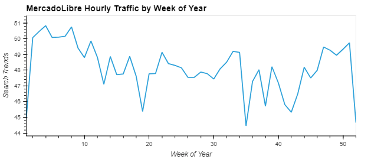
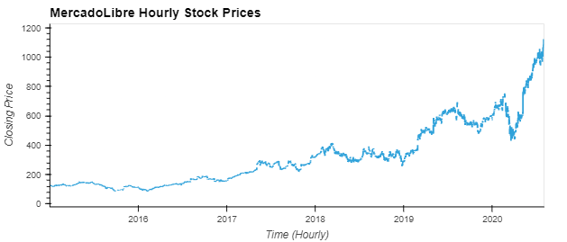
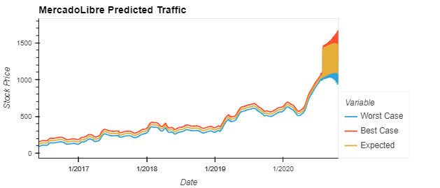
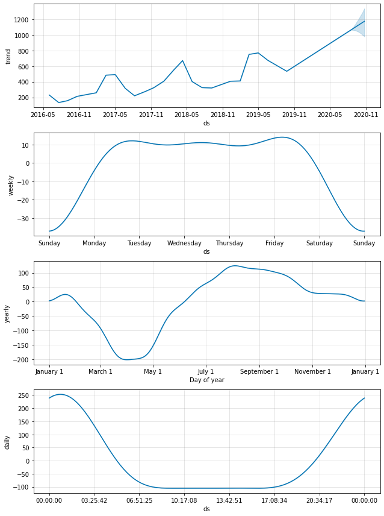
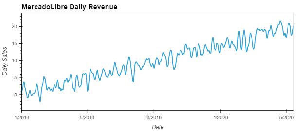
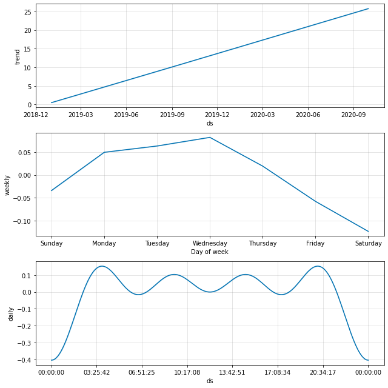
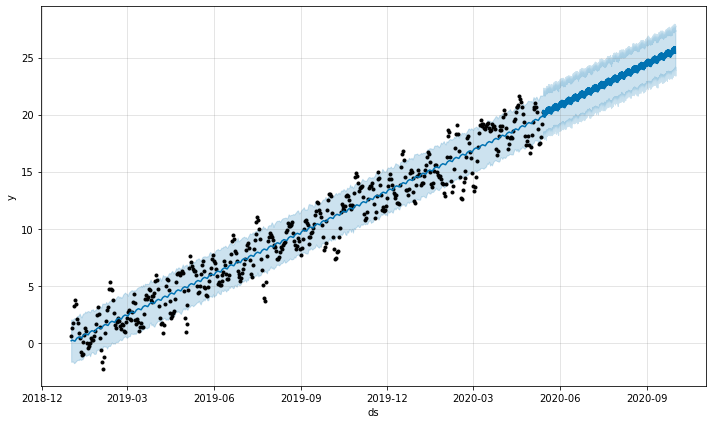

# Welcome to the Net Profit Forcasting Project!
#### Forecasting with Facebook Prophet
***
## Cotents<a id="Contents">
[Project Description](#Project-Description) 
[Technologies and Resources](#Technologies-Resources) 
[Installation Guide](#Installation-Guide) 
[Usage](#Usage) 
[Contributors](#Contributors) 
[License](#License) 
[Bottom of Page](#Bottom-of-Page) 

***
## <a id="Project-Description">Project Description</a>
This project applies time series analysis for forecasting, using Facebook Prophet, to identify trends and build predictions for both stock price and sales growth of the popular Latin American e-commerce giant <a href="https://mercadolibre.com/" title="https://mercadolibre.com/" target="_blank">MercadoLibre</a>. It also identifies MercadoLibre's online presence by analyzing related Google traffic over a period of time. Together this data can be compared to gte a better understanding of hourly, daily, monthly, and seasonal impacts on MercadoLibre's customer activity. 

By using Facebook Prophet, we are able to build a story of where the sales growth is currently at and where we believe it will be by identifying both short- and long-term trends. This project allows us to build this story by providing daily, weekly, monthly, and yearly visualizations to quickly understand and conclude high and low activity periods. This constructive information can aid in actionable, targeted responses for improved sales growth on all levels. 

Following the translation and predictions of the time series data, this project also presents an overall summary.  

#### Project layout:
The layout of this project is show below. 
. 
├── crypto_investments.ipynb 
├── data 
│   └── crypto_market_data.csv 
├── img 
│   ├── crypto-performance-clustering.png 
│   └── elbow-plot.png 
│   └── project_tree.png 
├── LICENSE 
├── README.md 
├── requirements.txt 
└── tree.txt 

***
## <a id="Technologies-Resources">Technologies and Resources</a>
#### Technologies:
<a href="https://docs.python.org/release/3.8.0/" title="https://docs.python.org/release/3.8.0/">

***
## <a id="Installation-Guide">Installation Guide</a>
### Project Installation
To install <a href="https://github.com/jasonjgarcia24/net-profit-forcasting.git" title="https://github.com/jasonjgarcia24/net-profit-forcasting.git">net-profit-forcasting</a>, type <code>git clone https://github.com/jasonjgarcia24/net-profit-forcasting.git</code> into bash in your prefered local directory.  
Alternatively, you can navigate to the same address (<code>https://github.com/jasonjgarcia24/net-profit-forcasting.git</code>) and download the full <code>main</code> branch's contents as a zip file to your prefered local directory. 

## <a id="Usage">Usage</a>
Observe net-profit-forcasting with <code>forecasting_net_prophet.ipynb</code>. No input variables are required. 

### Outputs
This tool provides several visualizations for both MercadoLibre Google traffic and sales performance analysis:
1. Hourly Google traffic trends by day of week and hour: 
 
This heatmap allows us to measure the distribution of Google traffic trends for MercadoLibre. 

2. Hourly Google traffic trends by week of year: 
 
This plot allows us to identify periods throughout the year of high and low traffic for MercadoLibre. 
    
3. Hourly stock price for the past five years: 
 
This plot allows us to view the overall trend in MercadoLibre's stock prices over the past five years. 
    
4. Predicted stock price: 
 
This plot reflects the Facebook Prophet prediction of MercadoLibre's expected stock price with both best and worst case ranges. 
    
5. Hourly, daily, weekly, and monthly treding MercadoLibre stock prices: 
 
This plot provides an overall short- and long-term trends of MercadoLibre's stock price. 
    
6. Total daily revenue: 
 
This plot is a general review of MercadoLibre's overall daily revenue for the past year and a half. 
    
7. Daily, weekly, and monthly trending daily revenue: 
 
This plot is allows us to view the short- and long-term trends of MercadoLibre's daily revenue. 
    
8. Predicted daily revenue: 
 
This plot reflects the Facebook Prophet prediction of MercadoLibre's expected daily revenue for 2020 Q3. 

***
## <a id="Contributors">Contributors</a>
Currently just me :) 

***
## <a id="License">License</a>
Each file included in this repository is licensed under the <a href="https://github.com/jasonjgarcia24/net-profit-forcasting/blob/c95b7c4ebcb37ac7e5f2f91505f7e796137f99eb/LICENSE" title="LICENSE">MIT License.</a>

***
[Top of Page](#Top-of-Page) 
[Contents](#Contents) 
[Project Description](#Project-Description) 
[Technologies and Resources](#Technologies-Resources) 
[Installation Guide](#Installation-Guide) 
[Usage](#Usage) 
[Contributors](#Contributors) 
[License](#License) 

